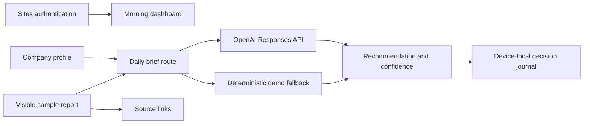

# CFO Signal Desk

CFO Signal Desk is a private morning finance brief for CFOs and finance leaders. It turns a small set of material company signals into executive context, a recommended decision, immediate actions, and a reviewable decision record.

The product answers four questions in less than five minutes:

1. What happened?
2. Why does it matter to this company?
3. What deserves consideration today?
4. How confident is the recommendation?

## MVP Scope

- Sign in with ChatGPT using Sites-managed authentication
- Editable company profile and business priorities
- Executive dashboard centered on one primary decision
- Daily executive brief with deterministic demo fallback
- Signal cards that separate facts from interpretation
- Confidence and permission to act shown independently
- Decision journal stored on the current device
- Direct source links to the visible demonstration dataset
- English and Spanish interface support

The MVP intentionally excludes connectors, document parsing, user management, and enterprise integrations.

## Architecture Overview



Key implementation choices:

- `app/page.tsx` provides the authenticated server entry point.
- `app/dashboard-client.tsx` contains the focused morning workflow and device-local profile/journal state.
- `app/api/brief/route.ts` requires an authenticated user, uses the OpenAI Responses API when configured, and returns a deterministic brief when it is not.
- `public/sample-data/management-report.json` makes every demonstration claim inspectable.
- `app/chatgpt-auth.ts` uses Sites-provided identity headers and dispatcher-owned sign-in routes.

## Technology

- Next.js and React
- TypeScript
- Tailwind CSS v4
- OpenAI Responses API
- Vinext / Cloudflare-compatible Sites output

## Run Locally

```bash
npm install
npm run dev
```

The Sites production environment supplies authentication headers. For full authenticated rendering outside Sites, send the documented `oai-authenticated-user-email` header through a trusted local proxy. The automated render test covers both authenticated and anonymous states.

## Environment Variables

Optional OpenAI generation:

```bash
OPENAI_API_KEY=your_api_key_here
OPENAI_MODEL=gpt-5.6
```

No environment variable is required for demo mode. If the API key is missing or the upstream request fails, the same complete CFO workflow remains available with deterministic sample data.

## Validation

```bash
npm run lint
npm test
```

`npm test` builds the production application and verifies the authenticated dashboard, anonymous sign-in surface, demo contract, source data, and core product language.

## Project Structure

```text
app/
  api/brief/route.ts       Authenticated brief generation and demo fallback
  chatgpt-auth.ts          Sites authentication helpers
  dashboard-client.tsx     Morning workflow, company profile, and journal
  globals.css              Responsive executive interface
  layout.tsx               Metadata and root layout
  page.tsx                 Authenticated server entry point
public/sample-data/
  management-report.json   Inspectable demonstration source
docs/
  architecture.md          Technical and product architecture
  demo-script.md           Short product demonstration script
tests/
  rendered-html.test.mjs   Production render and contract tests
```

## Deployment

The repository contains `.openai/hosting.json` and is configured for OpenAI Sites. Build with `npm run build`, save the validated version through Sites, and publish that saved version.

The same application structure can be deployed to another Next.js-compatible platform, but Sites-managed authentication must be replaced with that platform's trusted server-side identity mechanism.

## Product Filter

Every addition must improve decision quality, decision speed, or decision confidence. If it does not reduce executive uncertainty, it does not belong in the MVP.
