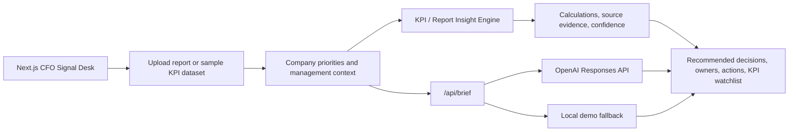

# CFO Signal Desk

OpenAI Build Week MVP: an AI Management Reporting OS module that turns company reports, KPIs, and business context into verified insights, decisions, and actions.

The product answers: **What changed, why did it change, what does it mean for management, and what should we do next?**

Motto: **From Signal to Decision.**

## Product Overview

CFO Signal Desk is built for CFOs, Finance Directors, FP&A Managers, Controllers, and finance teams who need management-ready insight rather than another KPI dashboard.

Simple promise: **Upload business data. Get decision-ready insights.**

The product constitution is documented in `docs/product-constitution.md`. Every future feature should pass this filter: **Does this reduce executive uncertainty?**

The MVP includes:

- Report and KPI input flow with **Upload company report** and **Try sample report** options.
- Sample management report dataset with revenue, average order value, gross margin, operating cost, and cash conversion cycle.
- KPI variance analysis against budget and prior period.
- Insight engine that classifies every output as verified finding, calculated result, hypothesis, or missing data.
- Insight cards with observation, business impact, likely driver, confidence, recommended action, source evidence, and calculation.
- Executive summary, management questions, KPI watchlist, recommended decisions, owners, and risk of inaction.
- Company priority selection for Revenue Growth, Margin Protection, Cash Preservation, Cost Control, Customer Retention, and Operational Efficiency.
- AI OS loop: Observe -> Interpret -> Decide -> Act -> Learn.
- Demo mode with realistic sample data so judging and demos work without external APIs.

## Architecture Overview



Key design choices:

- `app/page.tsx` contains the report input flow, sample KPI dataset, insight engine UI, executive decisions, and AI OS loop.
- `app/api/brief/route.ts` calls the OpenAI Responses API when `OPENAI_API_KEY` is present.
- The API route falls back to local demo generation whenever credentials or upstream calls are unavailable.
- The UI is responsive, finance-oriented, and optimized for a 90-second Build Week demo.
- File upload parsing is intentionally post-MVP; the current upload control demonstrates the workflow while the sample report powers the reliable demo.

## Tech Stack

- Next.js
- TypeScript
- React
- TailwindCSS v4
- OpenAI Responses API
- Vinext / Cloudflare-compatible build output
- Vercel-ready application structure

## Installation

```bash
npm install
npm run dev
```

Open the local URL printed by the dev server.

## Environment Variables

Create `.env.local` when using the OpenAI integration:

```bash
OPENAI_API_KEY=your_api_key_here
OPENAI_MODEL=gpt-5.6
```

`OPENAI_MODEL` is configurable. The app defaults to `gpt-5.6` because that was specified in the Build Week prompt. If that model is not available in your account, set this variable to an available GPT model.

Demo mode works without any environment variables.

## Project Structure

```text
app/
  api/brief/route.ts      AI brief generation endpoint with demo fallback
  globals.css             Product styling and responsive layout
  layout.tsx              Metadata and app shell
  page.tsx                CFO Signal Desk report insight engine
docs/
  architecture.md         Technical and product architecture notes
  demo-script.md          Suggested demo video script
  product-constitution.md Product principles and decision filter
  submission-checklist.md Build Week submission checklist
screenshots/
  README.md               Screenshot capture guide
public/
  og.png                  Social preview image
tests/
  rendered-html.test.mjs  Build/render smoke tests
```

## Local Validation

```bash
npm run lint
npm run build
npm test
```

## Deployment

### Vercel

1. Push this repository to GitHub.
2. Import the project in Vercel.
3. Add `OPENAI_API_KEY` and `OPENAI_MODEL` in Vercel Project Settings if using live AI generation.
4. Deploy.

The app remains usable without the OpenAI key because demo mode is built in.

### Sites / Cloudflare-Compatible Build

The included `vinext` setup can also produce the Sites-compatible build:

```bash
npm run build
```

## Demo Flow

1. Open CFO Signal Desk and state the problem: dashboards show KPI performance, but executives still need to know what changed, why, and what to do.
2. Show the headline: **Turn company reports and KPIs into management decisions.**
3. Use **Try sample report** or stage a report through **Upload company report**.
4. Select company priorities such as Margin Protection, Cash Preservation, and Cost Control.
5. Review KPI variances: Revenue, Average Order Value, Gross Margin, Operating Cost, and Cash Conversion Cycle.
6. Open the top insight: revenue is 8% below budget, but the real issue is AOV decline and gross margin erosion.
7. Show evidence, calculation, confidence, finding type, likely driver, and recommended action.
8. Review recommended decisions, owners, risks of inaction, management questions, and KPI watchlist.
9. Close with the vision: this is the first module of an AI Management Reporting OS.

## Submission Assets

- Product description: this README.
- Demo script: `docs/demo-script.md`.
- Architecture overview: `docs/architecture.md`.
- Feature list: this README and checklist.
- Screenshots folder: `screenshots/`.
- Social preview image: `public/og.png`.

## Founder Advantage

The founder advantage is finance-domain judgment: 14 years across finance, accounting, reporting, budgeting, control, operational finance, multi-country work, business partnering, risk, control, and management decision processes.

That experience helps define which KPI matters, which variance deserves management attention, which data must be verified before interpretation, and which output changes a real decision.

## Remaining Improvements

- Parse uploaded Excel, CSV, and PDF files.
- Add budget, prior-period, and forecast import templates.
- Add persistent company memory and prior decision tracking.
- Add live ERP, reporting, and BI connectors.
- Add PDF and board-pack export.
- Add management action tracker with owners, dates, and follow-up KPIs.
- Extend later into Finance Signal Desk, Sales Signal Desk, Operations Signal Desk, and CEO Brief.
