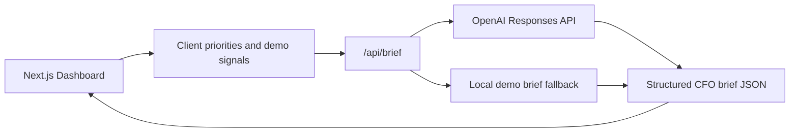

# CFO Signal Desk

OpenAI Build Week MVP: an AI-powered executive cockpit that transforms fragmented macroeconomic, FX, company, and market information into a five-minute CFO briefing.

The product answers: **What happened today, why does it matter, and what should I do tomorrow?**

## Product Overview

CFO Signal Desk is built for CFOs, FP&A Directors, Finance Managers, Controllers, and SME CEOs who need fast, board-ready finance interpretation rather than a pile of disconnected headlines.

The MVP includes:

- Executive dashboard with Today's Brief, Risks, Opportunities, FX, Inflation, Interest Rates, Company Priorities, Watchlist, and Action Items.
- AI brief generator structured as Executive Summary, Key Signals, Financial Impact, Operational Impact, Recommended Decisions, and Tomorrow's Watchlist.
- Risk detection for FX volatility, liquidity, inflation pressure, working capital, cost increases, and supply chain alerts.
- Decision recommendations for each important signal.
- Priority selection for Cash Flow, Working Capital, Revenue Growth, Cost Optimization, FX Exposure, Treasury, Investments, and Procurement.
- Demo mode with realistic sample data so judging and demos work without external APIs.

## Architecture Overview



Key design choices:

- `app/page.tsx` contains the interactive cockpit and deterministic demo data.
- `app/api/brief/route.ts` calls the OpenAI Responses API when `OPENAI_API_KEY` is present.
- The API route falls back to local demo generation whenever credentials or upstream calls are unavailable.
- The UI is responsive, finance-oriented, and optimized for a five-minute executive readout.
- No external market data API is required for the MVP.

## Tech Stack

- Next.js
- TypeScript
- React
- TailwindCSS v4
- OpenAI Responses API
- Vinext / Cloudflare-compatible build output
- Vercel-ready application structure

## Installation

```bash
npm install
npm run dev
```

Open the local URL printed by the dev server.

## Environment Variables

Create `.env.local` when using the OpenAI integration:

```bash
OPENAI_API_KEY=your_api_key_here
OPENAI_MODEL=gpt-5.6
```

`OPENAI_MODEL` is configurable. The app defaults to `gpt-5.6` because that was specified in the Build Week prompt. If that model is not available in your account, set this variable to an available GPT model.

Demo mode works without any environment variables.

## Project Structure

```text
app/
  api/brief/route.ts      AI brief generation endpoint with demo fallback
  globals.css             Product styling and responsive layout
  layout.tsx              Metadata and app shell
  page.tsx                CFO Signal Desk dashboard
docs/
  architecture.md         Technical and product architecture notes
  demo-script.md          Suggested demo video script
  submission-checklist.md Build Week submission checklist
screenshots/
  README.md               Screenshot capture guide
public/
  og.png                  Social preview image
tests/
  rendered-html.test.mjs  Build/render smoke tests
```

## Local Validation

```bash
npm run build
npm test
```

## Deployment

### Vercel

1. Push this repository to GitHub.
2. Import the project in Vercel.
3. Add `OPENAI_API_KEY` and `OPENAI_MODEL` in Vercel Project Settings if using live AI generation.
4. Deploy.

The app remains usable without the OpenAI key because demo mode is built in.

### Sites / Cloudflare-Compatible Build

The included `vinext` setup can also produce the Sites-compatible build:

```bash
npm run build
```

## Demo Flow

1. Open the dashboard and describe the target user: a CFO or finance leader under time pressure.
2. Show Today's Brief and the market risk cards.
3. Toggle company priorities such as Cash Flow, Working Capital, FX Exposure, and Procurement.
4. Click **Generate AI Brief**.
5. Explain the structured output: executive summary, key signals, financial impact, operational impact, recommended decisions, and tomorrow's watchlist.
6. Close with the value proposition: fewer fragmented signals, faster CFO decisions.

## Submission Assets

- Product description: this README.
- Demo script: `docs/demo-script.md`.
- Architecture overview: `docs/architecture.md`.
- Feature list: this README and checklist.
- Screenshots folder: `screenshots/`.
- Social preview image: `public/og.png`.

## Remaining Improvements

- Add live data connectors for FX, inflation, central bank events, commodities, and company ERP data.
- Add authenticated company workspaces.
- Add persistent daily briefing history.
- Add export to PDF, email, Slack, or board-pack formats.
- Add scenario modeling for FX and working capital shocks.
