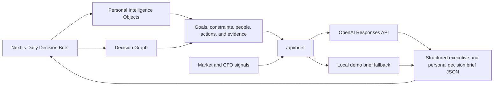

# CFO Signal Desk

OpenAI Build Week MVP: a Personal Executive Decision Intelligence system that transforms fragmented macroeconomic, FX, company, market, and personal professional context into concrete executive decisions.

The product answers: **What is the best decision for me today, given what is happening externally, what I am trying to achieve, and what changed in my personal and professional context?**

Motto: **From Signal to Decision.**

## Product Overview

CFO Signal Desk is built for finance leaders who need fast, board-ready decision support rather than another dashboard of disconnected signals. The current MVP combines CFO market intelligence with a personal decision layer for a finance leader managing job search, professional network, product building, and financial runway.

The product constitution is documented in `docs/product-constitution.md`. Every future feature should pass this filter: **Does this reduce executive uncertainty?**

The MVP includes:

- Executive Decision Intelligence cockpit with Next Decision, Highest Priority Risks, Opportunities, Recommended Decisions, Immediate Actions, Tomorrow Watchlist, and a signal-level Decision Framework.
- Daily Decision Brief primary experience covering what changed, top risks, top opportunities, decisions requiring attention, recommended priorities, three actions today, people to contact, items that can wait, strategic alignment, and tomorrow watchlist.
- Personal Intelligence data model for goals, constraints, commitments, decisions, open decisions, opportunities, risks, actions, relationships, hypotheses, results, lessons, preferences, and strategic priorities.
- Mock ingestion layer for daily notes, LinkedIn, career history, job pipeline, calendar, email, tasks, financial context, and market signals.
- Decision Graph that connects signals, goals, constraints, people, decisions, actions, and results.
- LinkedIn Intelligence panel for professional positioning, target role alignment, content themes, network opportunities, recruiter signals, and career narrative consistency.
- Privacy and control controls to disable data sources, inspect evidence, approve inferences, mark them incorrect, edit them, or delete them.
- AI brief generator structured as Executive Summary, Highest Priority Risks, Opportunities, Recommended Decisions, Today / This Week / This Month actions, and Tomorrow Watchlist.
- Risk detection for FX volatility, liquidity, inflation pressure, working capital, cost increases, and supply chain alerts.
- Explainable decision recommendations for each important signal, including why, why now, ignored consequence, KPI affected, confidence, and priority level.
- Priority selection for Cash Flow, Working Capital, Revenue Growth, Cost Optimization, FX Exposure, Treasury, Investments, and Procurement.
- Demo mode with realistic sample data so judging and demos work without external APIs.

## Architecture Overview



Key design choices:

- `app/page.tsx` contains the Daily Decision Brief, Personal Intelligence model, mock ingestion controls, Decision Graph, LinkedIn Intelligence, and deterministic demo data.
- `app/api/brief/route.ts` calls the OpenAI Responses API when `OPENAI_API_KEY` is present.
- The API route falls back to local demo generation whenever credentials or upstream calls are unavailable.
- The UI is responsive, finance-oriented, and optimized for a 60-second personal executive decision readout.
- No external market data API is required for the MVP.

## Tech Stack

- Next.js
- TypeScript
- React
- TailwindCSS v4
- OpenAI Responses API
- Vinext / Cloudflare-compatible build output
- Vercel-ready application structure

## Installation

```bash
npm install
npm run dev
```

Open the local URL printed by the dev server.

## Environment Variables

Create `.env.local` when using the OpenAI integration:

```bash
OPENAI_API_KEY=your_api_key_here
OPENAI_MODEL=gpt-5.6
```

`OPENAI_MODEL` is configurable. The app defaults to `gpt-5.6` because that was specified in the Build Week prompt. If that model is not available in your account, set this variable to an available GPT model.

Demo mode works without any environment variables.

## Project Structure

```text
app/
  api/brief/route.ts      AI brief generation endpoint with demo fallback
  globals.css             Product styling and responsive layout
  layout.tsx              Metadata and app shell
  page.tsx                Daily Decision Brief and Personal Intelligence system
docs/
  architecture.md         Technical and product architecture notes
  demo-script.md          Suggested demo video script
  product-constitution.md Product principles and decision filter
  submission-checklist.md Build Week submission checklist
screenshots/
  README.md               Screenshot capture guide
public/
  og.png                  Social preview image
tests/
  rendered-html.test.mjs  Build/render smoke tests
```

## Local Validation

```bash
npm run build
npm test
```

## Deployment

### Vercel

1. Push this repository to GitHub.
2. Import the project in Vercel.
3. Add `OPENAI_API_KEY` and `OPENAI_MODEL` in Vercel Project Settings if using live AI generation.
4. Deploy.

The app remains usable without the OpenAI key because demo mode is built in.

### Sites / Cloudflare-Compatible Build

The included `vinext` setup can also produce the Sites-compatible build:

```bash
npm run build
```

## Demo Flow

1. Open the cockpit and describe the target user: a CFO or finance leader under time pressure.
2. Show the Best Decision Today panel and explain that the product starts with the decision, not raw data.
3. Open the source controls and disable one source to show user control over context.
4. Review the Daily Decision Brief: what changed, why it matters, objective, constraint, decision options, recommended decision, risk of inaction, success metric, and monitor next.
5. Inspect Personal Intelligence objects and approve, edit, mark incorrect, or delete an inference.
6. Show the Decision Graph connecting market signals, goals, constraints, people, actions, and results.
7. Show LinkedIn Intelligence decisions for positioning, role prioritization, content themes, and network opportunities.
8. Close with the value proposition: external context plus personal strategy becomes one executive action plan.

## Submission Assets

- Product description: this README.
- Demo script: `docs/demo-script.md`.
- Architecture overview: `docs/architecture.md`.
- Feature list: this README and checklist.
- Screenshots folder: `screenshots/`.
- Social preview image: `public/og.png`.

## Remaining Improvements

- Add live data connectors for FX, inflation, central bank events, commodities, and company ERP data.
- Add authenticated company workspaces.
- Add persistent daily briefing history.
- Add private memory storage with user-approved writeback.
- Add export to PDF, email, Slack, or board-pack formats.
- Add scenario modeling for FX and working capital shocks.
