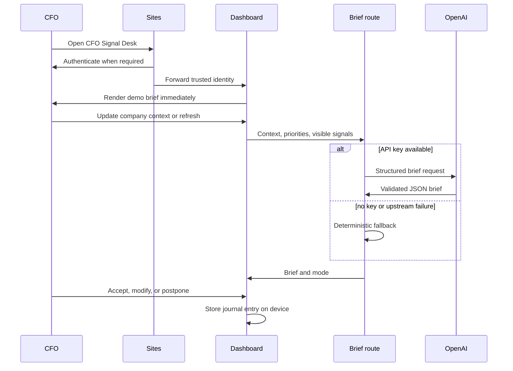

# Architecture Overview

## Product Boundary

CFO Signal Desk is a five-minute morning decision brief. The production MVP contains only authentication, company context, the executive dashboard, the daily brief, signal cards, the decision journal, and source links.

```text
Company context + visible source data
  -> Material signals
  -> Facts separated from interpretation
  -> Performance connection diagnosis
  -> Critical hazard and control review
  -> Executive recommendation
  -> Confidence and permission to act
  -> Immediate actions
  -> Decision journal and review date
```

## Application Layers

### Identity

Sites owns the ChatGPT sign-in, callback, and sign-out routes. Server code reads trusted identity headers through `app/chatgpt-auth.ts`. Anonymous visitors see a private sign-in surface; the dashboard and brief endpoint require identity.

### Experience

`app/dashboard-client.tsx` renders one coherent morning flow:

- company context strip
- one primary recommended decision
- no more than three simultaneous strategic initiatives
- three material signal cards
- visible performance, economic outcome, and cross-functional connection diagnosis
- concise executive brief
- critical hazards and resilience safeguards
- immediate actions and tomorrow watchlist
- decision journal
- inspectable source links

Company profile and journal entries persist only on the current device. This avoids a database and user-management layer in the MVP.

### Brief Generation

`app/api/brief/route.ts` receives company context, selected priorities, and the visible signals. When `OPENAI_API_KEY` is configured, it requests a structured executive brief from the OpenAI Responses API. When credentials or upstream generation are unavailable, it returns the deterministic brief used by the same interface.

The route does not equate confidence with permission to act. Confidence describes evidence quality; permission considers reversibility, downside, timing, and governance.

The same route enforces execution focus. It can consider many options, but returns at most three active strategic decisions. Additional ideas must replace an active priority or remain exploratory.

Before returning a recommendation, the route also requires a system-level hazard review: hidden assumptions, underestimated risks, missing controls, and events that could invalidate the strategy. Each decision carries a resilience safeguard so the brief moves from risk visibility to stronger controls without assigning blame.

The route also applies the Connection-to-Outcome model. It distinguishes visible activity from economic performance, identifies broken and productive links across commercial behavior, operations, finance, and cash, and attaches business connections plus a material trade-off to each recommendation.

### Sources

`public/sample-data/management-report.json` is the canonical demonstration source. Signal cards link directly to it and label facts separately from interpretations. The file also records calculations, limitations, and missing detail.

## Runtime Flow



## Security Boundary

- Authentication and authorization checks remain server-side.
- The API endpoint rejects unauthenticated requests.
- No API key is exposed to the browser.
- User-provided profile and journal data remain device-local in the MVP.
- Source links contain demonstration data only.
