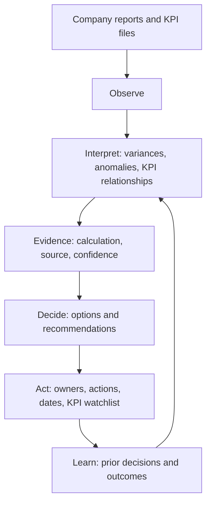

# Architecture Overview

## Product Layer

CFO Signal Desk turns company reports, KPIs, and business context into perspective, judgment, direction, and follow-up actions.

Core transformation:

```text
Report / Data / KPI
  -> Insight
  -> Decision
  -> Action
  -> KPI Watchlist
```

The product constitution in `docs/product-constitution.md` remains the governing filter. No workflow should stop before reaching an executive recommendation.

The personalization architecture in `docs/executive-data-input-personalization.md` defines how the product grows from report analysis into a personalized Executive Advisor through onboarding, company context, document intelligence, executive memory, goals, decision history, calendar intelligence, relationship intelligence, daily check-ins, and feedback learning.

The MVP combines:

- Report upload entry point
- Reliable sample management report
- English / Spanish language support for the full demo experience
- Company priority selection
- KPI variance analysis
- Source evidence and calculation display
- Insight classification
- Root-cause hypotheses
- Recommended decisions
- Owners and risks of inaction
- Management questions
- KPI watchlist
- AI OS loop: Observe -> Interpret -> Decide -> Act -> Learn

## Application Layer

- `app/page.tsx` renders the full demo workflow: report input, sample KPI dataset, report interpretation, direction, questions, tomorrow's attention, human advantage, and meaning loop.
- `app/globals.css` defines the responsive Bloomberg-meets-Linear visual system.
- `app/api/brief/route.ts` owns optional OpenAI generation and keeps the demo resilient with local fallback.

## AI Layer

The route uses the OpenAI Responses API when `OPENAI_API_KEY` is available. It asks the model to produce management reporting outputs, not generic summaries.

Expected AI behavior:

- Classify each insight as verified finding, calculated result, hypothesis, missing data, or management question.
- Explain source evidence and calculations.
- Identify business impact and likely drivers.
- Recommend management decisions and actions.
- Assign owners where appropriate.
- Explain risk of inaction.
- Produce a KPI watchlist.

If the OpenAI request fails or no key is configured, the route returns a deterministic local brief. This keeps demos reliable for Build Week judging.

## Data Layer

The MVP uses a realistic sample management report with:

- Revenue
- Average order value
- Gross margin
- Operating cost
- Cash conversion cycle

The current upload control demonstrates the intended workflow, but file parsing is post-MVP. This keeps the Build Week scope focused on the core product thesis: report and KPI data should become decision-ready management insight.

Future production data sources:

- Excel, CSV, and PDF uploads
- Budget and prior-period files
- ERP and accounting exports
- BI reports
- Sales and operations KPI feeds
- Management presentations
- Meeting notes and action logs
- Executive onboarding and daily check-ins
- Email, calendar, Slack, Teams, Notion, Drive, SharePoint, CRM, LinkedIn, market data, macro data, voice notes, and meeting transcripts

## Product Architecture



## Deployment Layer

The app is a TypeScript Next.js project and can be deployed to Vercel. The included Vinext setup also supports the local Sites build flow.
