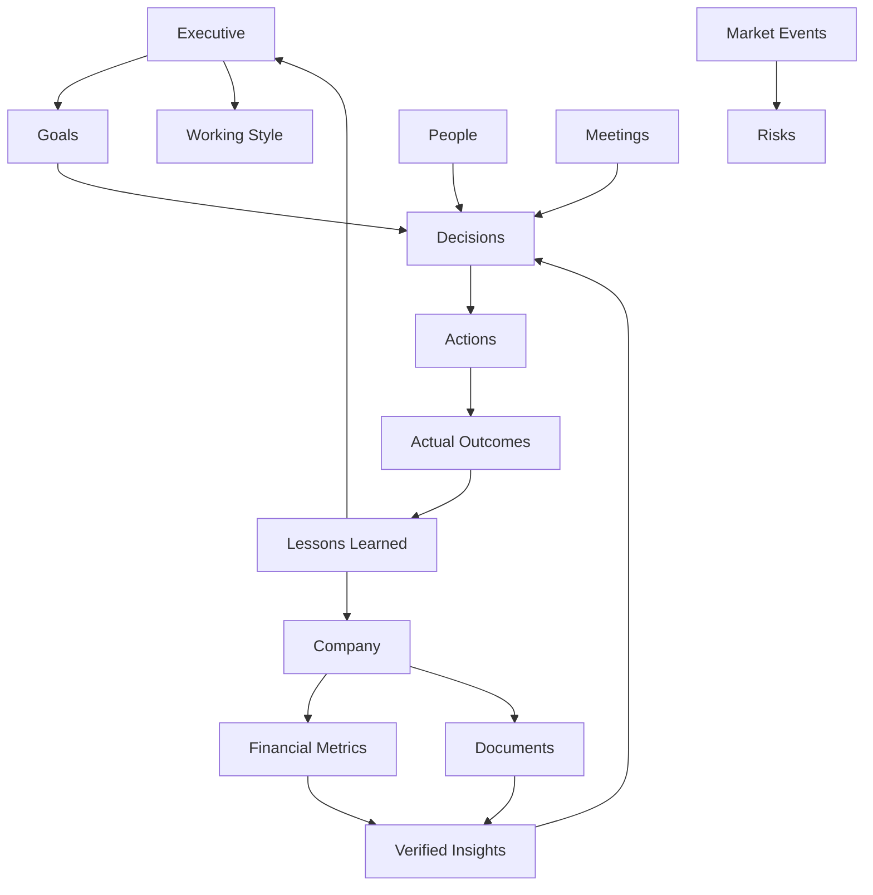

# Executive Data Input & Personalization System

## Product Intent

CFO Signal Desk should evolve from a useful report insight engine into a deeply personalized Executive Advisor. The platform should learn the executive, the company, the operating environment, prior decisions, goals, working style, risk appetite, and strategic priorities without making the user feel like they are filling out software forms.

Core principle:

```text
Every data point collected must improve future recommendations.
```

The experience should feel like onboarding a high-quality executive assistant:

- Ask only what is useful now.
- Explain why each question matters.
- Learn gradually through normal work.
- Distinguish confirmed facts from AI inference.
- Let the executive correct, approve, or ignore memory.

## Information Architecture

```text
CFO Signal Desk
  Home
    Today Decision Brief
    Three Recommended Actions
    Items That Can Wait
    Upcoming Decisions

  Report Insight Engine
    Upload / Sample Report
    KPI Variance Analysis
    Verified Insights
    Recommended Decisions
    KPI Watchlist

  Executive Profile
    Onboarding
    Role and Authority
    Communication Style
    Risk Appetite
    Leadership Style
    Personal Preferences

  Company Profile
    Business Model
    Revenue Streams
    Customers
    Geography
    Organization
    Competitors
    Strategic Priorities
    Annual Objectives
    Financial Targets

  Document Center
    Financial Reports
    Board Packs
    Strategy Decks
    Sales Reports
    Treasury Reports
    KPI Dashboards
    Org Charts
    Source Evidence

  Executive Memory
    Meeting Notes
    Voice Ideas
    Lessons Learned
    Board / CEO Comments
    Customer Insights
    Risks
    Market Observations
    Personal Reflections

  Goals
    Company Goals
    Department Goals
    Personal Goals
    Career Goals
    Learning Goals

  Decisions
    Decision History
    Active Open Decisions
    Expected Outcomes
    Actual Outcomes
    Lessons Learned

  Network
    Relationship Graph
    Board / CEO / Peers / Managers
    Clients / Investors / Recruiters
    Advisors

  Integrations
    Email
    Calendar
    Slack / Teams
    Drive / SharePoint
    ERP / CRM / BI
    LinkedIn
    Market and Macro Data
```

## Navigation Structure

Primary navigation should remain short:

1. Today
2. Reports
3. Memory
4. Goals
5. Decisions
6. Network
7. Company

Secondary settings should hide integration details:

- Connected Sources
- Data Permissions
- Memory Review
- Communication Preferences
- Export / Sharing

## Screen Flow

```text
First Launch
  -> Conversational Executive Onboarding
  -> Try Sample Report or Upload First Report
  -> First Decision Brief
  -> Confirm / Correct AI Inferences
  -> Save Executive Memory

Daily Use
  -> One-Minute Check-in
  -> Calendar and Data Context Refresh
  -> Today Decision Brief
  -> User Feedback on Recommendations
  -> Decision / Action Updates
  -> Memory Graph Update

Monthly Reporting
  -> Upload Report Pack
  -> Map Documents to Business Context
  -> KPI Variance Analysis
  -> Root-Cause Hypotheses
  -> Management Decisions
  -> Board / CEO Brief
  -> Outcome Tracking
```

## 1. Executive Onboarding

The onboarding should be conversational, progressive, and skippable. It should use language like:

> I will ask only what helps me give better recommendations. You can skip anything and correct me later.

| Field | Why it matters | How AI uses it |
| --- | --- | --- |
| Role | Defines the executive lens and responsibility boundary. | Changes recommendation level, wording, and decision ownership. |
| Industry | Determines relevant KPIs, cyclicality, risk types, and benchmark logic. | Adapts KPI interpretation and root-cause hypotheses. |
| Company size | Affects process maturity, resource constraints, and governance needs. | Calibrates recommendations to available capacity. |
| Team size | Shows execution bandwidth and delegation options. | Assigns realistic action owners and avoids overloading the user. |
| Responsibilities | Clarifies what the executive can influence. | Filters irrelevant recommendations. |
| Decision authority | Separates recommend, approve, escalate, and execute decisions. | Produces correct next steps and escalation paths. |
| KPIs | Defines the performance language of the executive. | Links every recommendation to relevant metrics. |
| Current challenges | Captures immediate context. | Prioritizes the first decision briefs. |
| Short-term goals | Shows what matters in the next 30-90 days. | Weights urgency and action timing. |
| Long-term goals | Protects strategic consistency. | Avoids short-term recommendations that damage long-term objectives. |
| Risk appetite | Determines how aggressive recommendations should be. | Calibrates risk, uncertainty, and action thresholds. |
| Leadership style | Shapes how decisions should be communicated and delegated. | Adapts tone, owner assignment, and meeting prep. |
| Preferred communication style | Reduces friction in daily usage. | Chooses concise, detailed, board-ready, direct, or coaching-style output. |

### Low-Friction Onboarding Flow

```text
Step 1: "What is your role and company context?"
Step 2: "Which KPIs define success for you?"
Step 3: "What are your top three priorities this quarter?"
Step 4: "Which decisions are currently occupying your attention?"
Step 5: "How direct should I be when giving recommendations?"
Step 6: "Review what I understood. Approve or correct."
```

## 2. Company Context

The Company Profile should be the system's business operating context. It should look like a concise company memo, not a settings page.

Core sections:

- Business model
- Revenue streams
- Customer segments
- Geographic exposure
- Organization structure
- Competitors
- Strategic priorities
- Annual objectives
- Financial targets
- Key risks
- Operating constraints
- Decision governance

The AI should use this profile to answer:

- Does this signal matter for this company?
- Which KPI is affected?
- Which leader owns the issue?
- Is this a strategic issue or operating noise?
- What would management do differently if this is true?

## 3. Document Center

The Document Center should make upload feel like giving context to an assistant.

Supported inputs:

- P&L
- Balance Sheet
- Cash Flow
- Budget
- Forecast
- Board Packs
- Strategy Decks
- Earnings Reports
- Treasury Reports
- Sales Reports
- KPIs
- Organizational Charts

For every uploaded document, the AI should ask:

| Question | Purpose |
| --- | --- |
| What is this? | Classifies the document and expected analysis type. |
| How frequently is it updated? | Determines cadence and freshness. |
| How important is it? | Sets priority and alert thresholds. |
| Who owns it? | Connects insight to responsible person. |
| Which decisions depend on it? | Links the document to decision workflows. |

Document metadata:

```text
Document
  title
  type
  period
  frequency
  owner
  importance
  freshness
  source system
  related KPIs
  related goals
  related decisions
  permission level
  confidence
  extraction status
```

## 4. Executive Memory

Executive Memory is a permanent knowledge base, but nothing should become permanent truth without confidence and user control.

Quick-add inputs:

- Meeting notes
- Voice ideas
- Random observations
- Lessons learned
- CEO comments
- Board comments
- Customer insights
- Risks
- Political developments
- Market observations
- Personal reflections

Automatic classification:

```text
Memory item
  -> fact
  -> preference
  -> risk
  -> decision
  -> open question
  -> lesson
  -> relationship update
  -> market observation
  -> strategic priority
  -> contradiction
```

Memory controls:

- Approve
- Edit
- Mark incorrect
- Archive
- Link to goal
- Link to decision
- Link to person
- Do not use for recommendations

## 5. Goals Engine

Every recommendation must reference active goals. If no goal is relevant, the AI should say so.

Goal types:

- Company goals
- Department goals
- Personal goals
- Career goals
- Learning goals

Goal schema:

```text
Goal
  title
  type
  owner
  time horizon
  target metric
  success definition
  current status
  priority
  related documents
  related people
  related decisions
  risks
  next milestone
```

Recommendation rule:

```text
No recommendation without:
  relevant goal
  impacted KPI or outcome
  reason now
  risk of inaction
  expected result
```

## 6. Decision History

Decision History turns the product from an analyzer into a learning system.

For every important decision store:

- Situation
- Context
- Alternatives
- Decision
- Reasoning
- Expected outcome
- Actual outcome
- Lessons learned
- Confidence level
- Participants
- Date

Decision lifecycle:

```text
Open Decision
  -> Options Generated
  -> Recommendation Made
  -> Decision Taken
  -> Action Assigned
  -> Outcome Reviewed
  -> Lesson Stored
```

Future recommendations should use this history to detect:

- Repeated unresolved decisions
- Decisions that keep missing expected outcomes
- Preference patterns
- Overconfidence patterns
- Delayed decisions becoming urgent
- Tradeoffs the executive repeatedly values

## 7. Calendar Intelligence

Integrations:

- Google Calendar
- Outlook
- Meetings
- Travel
- Board meetings
- 1:1s
- Customer meetings

Calendar Intelligence should infer:

- Which decisions are coming up
- Which documents are needed before meetings
- Which people need preparation
- Which goals or risks are relevant
- Whether the day has enough focus time for hard decisions

Calendar output examples:

- "Board meeting in 3 days. Prepare margin bridge and cash risk explanation."
- "Customer meeting tomorrow. Review pricing exceptions and receivables status."
- "Only 90 minutes of focus time today. Prioritize one decision, not three."

## 8. Relationship Intelligence

The Network Graph should store:

- Board members
- CEO
- Managers
- Peers
- Recruiters
- Investors
- Clients
- Trusted advisors
- Influence level
- Relationship strength
- Interaction history

Relationship schema:

```text
Person
  role
  organization
  relationship type
  influence level
  trust level
  communication style
  last interaction
  open commitments
  related decisions
  related goals
  risks
  next recommended touchpoint
```

The AI should use relationship context to recommend:

- Who to contact
- Who must be aligned before a decision
- Who may block execution
- Who should receive a brief
- Which relationship needs attention

## 9. Daily Check-In

The daily check-in should take one minute.

Questions:

- How are you feeling today?
- What is your current workload?
- What is today's priority?
- What is your biggest concern?
- What decision do you expect today?
- How much focus time do you have?

The AI should adapt recommendations:

- Low energy -> fewer decisions, clearer sequencing
- High workload -> highlight only what cannot wait
- Limited focus time -> recommend one high-leverage action
- High concern -> monitor related risks and prepare options

## 10. Feedback Learning Loop

Every recommendation should request lightweight feedback:

- Helpful
- Partially helpful
- Not helpful
- Why?

Feedback should update:

- Recommendation style
- Confidence calibration
- Risk threshold
- Detail level
- Preferred action format
- Goal weighting
- Decision pattern memory

Feedback prompt examples:

- "Was this recommendation useful?"
- "Did this miss important context?"
- "Should I be more direct next time?"
- "Was the action realistic?"

## Context Sources

Integration roadmap:

| Source | What it adds |
| --- | --- |
| Email | Commitments, decisions, risks, stakeholder signals. |
| Calendar | Upcoming decisions, meeting prep, time constraints. |
| Slack / Teams | Operating issues, informal decisions, blockers. |
| Notion | Strategy, project context, documentation. |
| Google Drive / SharePoint | Reports, board packs, source evidence. |
| ERP | Financial actuals, transactions, operational data. |
| CRM | Pipeline, customer signals, sales risk. |
| Power BI | KPI dashboards and trends. |
| Excel | Budgets, forecasts, analysis models. |
| PDF | Board packs, reports, external documents. |
| LinkedIn | Professional positioning, relationships, market signals. |
| Financial News | Company and market context. |
| Market Data | FX, rates, commodities, equities. |
| Macro Data | Inflation, interest rates, labor, GDP, country risk. |
| Voice Notes | Fast executive memory capture. |
| Meeting Transcripts | Decisions, action items, sentiment, open questions. |

## Executive Memory Graph

Nodes:

- Executive
- Company
- Goals
- Projects
- Meetings
- People
- Documents
- Financial Metrics
- Market Events
- Decisions
- Relationships
- Learning
- Ideas
- Risks
- Strategies

Edges:

- owns
- influences
- blocks
- supports
- contradicts
- decided
- requires
- updated by
- discussed in
- measured by
- depends on



## Personalization Engine

### Day 1

The system knows basic executive profile, company context, top goals, preferred communication style, and one sample report or uploaded document.

AI behavior:

- Mostly asks clarifying questions.
- Explains uncertainty.
- Uses conservative recommendations.
- Requests approval before storing memory.

### Week 1

The system has documents, recurring meetings, early feedback, priority goals, and several memory items.

AI behavior:

- Connects reports to goals.
- Prepares meeting-specific decision briefs.
- Starts identifying repeated risks.
- Adapts detail level and tone.

### Month 1

The system has decision history, KPI cadence, document patterns, stakeholder graph, and feedback history.

AI behavior:

- Compares periods.
- Flags unresolved decisions.
- Checks whether actions improved KPIs.
- Recommends owners and timing more accurately.

### Month 6

The system has enough history to understand management patterns and performance outcomes.

AI behavior:

- Detects recurring root causes.
- Challenges assumptions.
- Predicts decision bottlenecks.
- Identifies when stated goals and actual behavior diverge.

### Year 1

The system becomes a strategic memory layer for the executive and company.

AI behavior:

- Uses long-term decision outcomes.
- Builds company-specific management playbooks.
- Helps prepare annual planning, board narratives, and strategic tradeoffs.
- Acts as a trusted decision intelligence partner.

## AI Behavior Evolution

```text
Information Assistant
  -> answers questions and summarizes documents

Business Assistant
  -> understands company context and prepares useful briefs

Finance Advisor
  -> interprets KPIs, risks, variances, and cash / margin impact

Executive Advisor
  -> recommends decisions, owners, sequencing, and tradeoffs

Trusted Strategic Partner
  -> remembers history, challenges assumptions, learns patterns, and improves judgment quality
```

The transition happens through:

- More confirmed context
- More documents
- More decisions
- More outcomes
- More feedback
- Better relationship graph
- Better goal weighting
- Better confidence calibration

## Recommendation Engine Architecture

```text
Inputs
  documents
  metrics
  goals
  calendar
  people
  decisions
  memory
  market context
  daily check-in

Processing
  classify source
  extract facts
  calculate metrics
  identify variance
  map to goals
  find related people
  compare decision history
  detect contradictions
  score urgency and impact
  generate options
  recommend action

Output
  executive summary
  verified insights
  risks and opportunities
  recommended decisions
  owners and next actions
  source evidence
  confidence
  questions to ask
  KPI watchlist
  feedback request
```

## Low-Fidelity Wireframes

### Today

```text
┌─────────────────────────────────────────────────────────────┐
│ Today Decision Brief                                         │
│ Critical Decision: [one sentence recommendation]             │
│ Why now | Risk of inaction | Goal affected | Confidence      │
├───────────────────────┬─────────────────────────────────────┤
│ 3 Actions Today        │ Upcoming Decisions                  │
│ Items That Can Wait    │ Calendar / Meeting Context          │
├───────────────────────┴─────────────────────────────────────┤
│ Feedback: Helpful / Partially / Not helpful                  │
└─────────────────────────────────────────────────────────────┘
```

### Report Insight Engine

```text
┌─────────────────────────────────────────────────────────────┐
│ Upload Report | Try Sample Report | Company Priorities       │
├─────────────────────────────────────────────────────────────┤
│ KPI Variance Table                                           │
│ Revenue | AOV | Margin | Cash Cycle | Cost                   │
├─────────────────────────────────────────────────────────────┤
│ Insight Detail                                               │
│ Observation | Business Impact | Driver | Recommendation      │
│ Evidence | Calculation | Confidence | Finding Type           │
├─────────────────────────────────────────────────────────────┤
│ Decisions | Owners | Risk of Inaction | KPI Watchlist         │
└─────────────────────────────────────────────────────────────┘
```

### Memory Review

```text
┌─────────────────────────────────────────────────────────────┐
│ New Memories Detected                                        │
├─────────────────────────────────────────────────────────────┤
│ [Inference] CEO wants faster cash reporting                  │
│ Evidence: meeting note, board comment                        │
│ Approve | Edit | Mark Incorrect | Do Not Use                 │
└─────────────────────────────────────────────────────────────┘
```

## Product Philosophy

CFO Signal Desk is not a dashboard, not a chatbot, and not another generic AI assistant.

It is a Decision Intelligence Platform that becomes smarter as it learns the executive, the business, and the organization's unique context.

Every piece of information collected must improve:

- Decision quality
- Decision speed
- Decision confidence
- Follow-through
- Organizational memory
